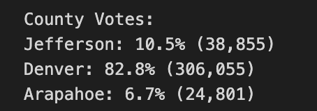
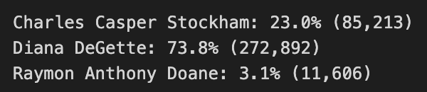

## Overview of Election Audit
This is an election audit of a congressional election for the election commission. The purpose of this audit is to better understand and analyze the outcome of the election. This audit was conducted by using Python to loop through the election results, counting the votes for each of the three candidates and counties.

## Election-Audit Results

* 369,711 votes were cast in this congressional election. 

* See the image below for a breakdown of the number of votes and the percentage of total votes for each county in the precinct.

* With 306,055 votes, Denver had the largest number of votes.

* See the image below for a breakdown of the number of votes and the percentage of the total votes each candidate received.

* Dianna DeGette won the election with 272,892 votes, and 73.8% of the total votes. 

## Election-Audit Summary
Although this audit was conducted for this election specifically, the Python script could easily be repurposed for another election audit. Some modifications that may need to occur to repurpose this script might involve changing the way the file with the raw results are read in case they are in a different format, or modifying the looping conditions.